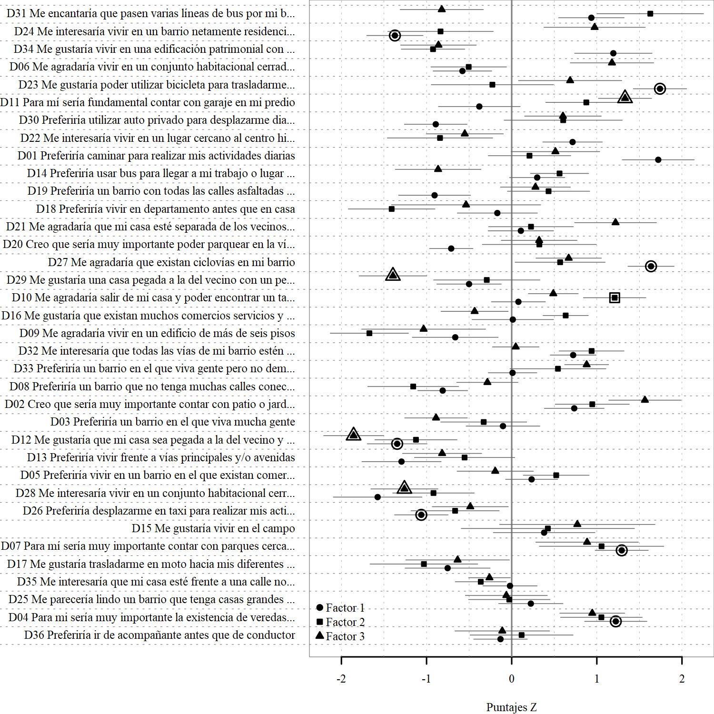

# Método Q: Forma Urbana y Transporte
Análisis de percepciones de la relación entre forma urbana y transporte utilizando el Método Q. Parte del proyecto REDU-FUT.

Grupo de Investigación LlactaLAB - Ciudades Sustentables. Universidad de Cuenca.
http:://llactalab.ucuenca.edu.ec

Cómo citar:

Orellana, D., Hermida C., Hermida, M.A. (2020). ¿Cerca o lejos? Discursos y subjetividad en las relaciones entre el lugar de residencia y la movilidad. Revista EURE (En Prensa)

